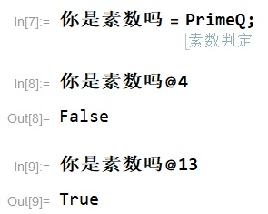

---
## 质数
人类对数论的研究可以追溯到公元前，在数论研究的悠久历史中，**质数是一个永恒的话题**。对于质数的判定，也永远是一个迷人的问题。

我们这样定义质数：**如果自然数 p > 1 的因数只有1和它本身，那么 p 是质数**。

质数有很多美妙的性质，比如：

- 如果一个数是质数，那么它是自然数。
- 如果一个数是质数，那么它不是合数。
- 如果一个数是质数，那么它大于等于2。

相信我们聪明的读者不难证明这些性质。

接下来，让我们进入正题：**如何判定一个数是不是质数**？

---

## 入门版
素数判定这种高深的数论问题，**用一般的编程语言肯定难以优雅地实现**。所以，我们**必须使用 Wolfram Language 这样专门用于数学计算的语言**，才能写出“出淤泥而不染，濯清涟而不妖”的美妙实现。


你是素数吗 = PrimeQ;
```

我们来看一个例子：


这种纯粹的感觉，就像在QQ群里at你的同学一样自然！

但是，我们不能沉溺于舒适区，要勇于面对自己，我们要前往混沌邪恶的 C\+\+ 领域。

---

## 初级版
在进入这一章节之前，我们需要一些**十分复杂**的数论推导，不喜欢看公式的同学可以暂时跳过下面一小段。

> 要判断一个数是不是质数，其实和判断一个数是不是合数没有太大区别。要判断一个数是合数，按照定义来看，只需要找到一个不是1和它本身的因数就可以。如果我们对一个数 n，找到了这样的因数 m，也就是 m 整除 n，此时一定会有 $$m \le n$$ 。所以，我们只需要在 2~n\-1 的范围内寻找 n 的因数就可以了。

*上面的推导中居然出现了整整一个公式！我这篇回答的读者要跑掉一半了！*

根据上面的数论推导，我们可以写出如下的质数判断程序：

```c++
bool 你是质数吗(int n) {
    if (n <= 1) return false;
    for(int i = 2; i < n; ++i)
        if (n % i == 0) return false;
    return true;
}

```

在这里，我们约定负数和0不是质数。

*看 C\+\+ 这混沌邪恶的语法，反人类的 for 循环，甚至连 bool 都只是语法糖，在输出的时候只能给出一个冷冰冰的 0 和 1，一点不考虑用户体验*……

---

## 高级版
在上面的算法中，我们需要穷举2~n\-1的所有整数。真的就没有改进方法了吗？

在古希腊时期，有一位数学家叫**埃拉托斯特尼**，提出了一种方法，叫做**埃拉托斯特尼筛法**。**埃拉托斯特尼筛法**是非常经典的质数判定算法，在各种要求精确解的质数判定中，大多数都能见到**埃拉托斯特尼筛法**的影子。在这里，我必须多次重复**埃拉托斯特尼**这个长的要命的名字，以表达我对**埃拉托斯特尼**这位伟大先贤的崇高敬意。**埃拉托斯特尼筛法**的思想可以给我们很大的启发，**埃拉托斯特尼筛法**指导我们进一步缩小因数的搜索范围。

为此，我们仍然需要**更加复杂**的数论推导。

> 对于合数 n，我们可以证明它一定有一个小于等于 $$\sqrt{n}$$ 的非平凡因数。这里的非平凡因数，指的是和1与他本身不同的因数。
> 
> 如果不是，那么它所有的非平凡因数都是大于 $$\sqrt{n}$$ 的。我们任取其中一个和n不同的非平凡因数 m，那么存在整数 k 使 n=km，那么 k 也为 n 的非平凡因数，但是 $$k=\frac{n}{m}<\sqrt{n}$$ ，矛盾。所以合数 n 一定有一个小于等于 $$\sqrt{n}$$ 的非平凡因数。

*到现在为止我已经用了5个公式了！我的读者已经只剩1/32了！*

因此，我们只需要在2到 $$\left[ \sqrt{n} \right]$$ 之间寻找 n 的因数。（这里的 $$\left[ x \right]$$ 表示不超过 x 的最大整数。）

*不对，我怎么又用了两个公式*……

```c++
bool 你是质数吗(int n) {
    if (n <= 1) return false;
    for(int i = 2; i * i <= n; ++i)
        if (n % i == 0) return false;
    return true;
}

```

---

## 超极版
我们刚才的算法都是按照质数的定义，去找一个数有没有因数，这种做法**太 naive 了**。

那么，有没有什么能判定质数的**高级定理**呢？

为了写这篇文章，我耗费了**整整180秒**上网查资料，找到了这么一个定理：

**威尔逊定理**：对于自然数 p>1，p 是质数当且仅当 $$(p-1)! \equiv -1 \pmod{p}$$ 。

*我怎么又用了公式！还用了同余符号！我的读者会全跑掉的啊！*

按照上面的想法，我们只要求出 $$(p-1)!+1$$ 除以 p 的余数，看看是不是0就好了。

```c++
bool 你是质数吗(int n) {
    if (n <= 1) return false;
    int factor = 1;
    for(int i = 2; i < n; ++i)
        factor = ((long long)factor * i) % n;
    factor = (factor + 1) % n;
    return factor == 0;
}

```

> 等等，这个算法好像比上面两个都要慢啊！

速度什么不重要，重要的是让别人知道了我们能**熟练运用威尔逊定理这样高级的数论定理**。

还有，那个说在项目里这么写代码的会被人打死的站出bubyguoi;ohugkbvfdsvvgrt4u

---

## 上D版

*上D与你同在*
感谢上D把我复活，我又能回来写文章了。

刚才的方法，**无一例外**都是基于简单的数论原理，这种人工设计的算法难以发挥计算机真正的性能。

我们要逃脱手工设计算法的桎梏，进入**机器学习**的神圣殿堂。

于是我又花了整整200秒去查找资料，终于在一篇知乎回答中找到了实现方法：[能否使用神经网络来判断奇偶数？](https://www.zhihu.com/question/364113452/answer/996790012)

作者使用了端到端的双层 LSTM 网络，将数字转为字符串输入，在质数判定问题上进行了1分钟的训练，**效果拔群。**

神经网络学会了“不管你输入啥只要我蒙合数总比蒙质数对的多”。

按照这一思想，我们得出了一个对**几乎**全部自然数正确的质数判定算法：

```c++
bool 你是质数吗(int n) {
    return false;
}

```

多么简洁的逻辑！机器学习让我们发现了世界的本质，就是**大道至简**！只要我们愿意舍弃那么一（亿）点点正确性，一切都是如此简单！

---

## 撒D版

*欢迎来到D狱*
上D的算法没能给我们很大的帮助，但是这种思想给了我们一点启发：

> 算法的能力是有极限的。我从短暂的 OI 生活当中学到一件事：越是玩弄优化，就越会发现算法被时间复杂度所限制……除非超越算法。
> 
> 你到底想说什么？
> 
> 我不做人了，JOJO！（划去）**我不要精确度了**！

于是我们祭出了**费马小定理**：如果 p 是素数，那么有 $$a^p \equiv a \pmod p$$ 。

虽然**费马小定理的逆命题是不成立**的，但是不排除它在绝大多数情况下都是成立的。为了方便计算，取 a=2，于是我们又得出了一个对**几乎**全部自然数正确的质数判定算法：

```c++
bool 你是质数吗(int n) {
    if (n <= 1) return false;
    int t = 1, m = 2, p = n;
    while(p) { // 快速幂取模
        if (p % 2) t = ((long long)t * m) % n;
        m = (m * m) % n;
        p >>= 1;
    }
    t = (t - 2) % n;
    return t == 0;
}

```

这个算法的速度相比之前的算法，完全不在一个数量级上，只是精确度稍微差了那么一（亿）点点。比如经典的卡迈克数561，它虽然是合数（561=3×11×17），但是会被这个算法判定为质数。

但是，如果我们对这一算法**进行一（亿）点点改进**，就能得到大名鼎鼎的 **Miller\-Rabin 素性检验算法**[^1]。这一算法在费马小定理之外，还需要另一个**更加复杂**的数论定理：

**二次检验定理**：对于质数 p，在0~p\-1范围内，满足 $$x^2\equiv 1\pmod p$$ 的整数只有 1 和 p\-1。

*证明就留做习题吧。*

根据二次检验定理，对于一个整数 x，如果 $$x^2,x^4,x^8,\cdots$$ 除以 n 的余数都不为1，那么 n 就很有可能是一个质数。

然后我们再把费马小定理换个形式，如果 $$a^{n-1}$$ 除以 n 的余数为1，那么 n 很可能是一个质数。

接下来，就是撒D赐予我们的鬼才逻辑了。首先把 n\-1 分解为 $$2^s\cdot t$$ ，接着再把 $$a^t$$ 不断平方，每平方一次，进行一次二次检验，这样平方 s 次之后，恰好就求出了 $$a^{n-1}$$ 。

```c++
int prime[10]={2, 3, 5, 7, 11, 13, 17, 19, 23, 29};
bool 你是质数吗(int n) {
    if (n <= 1) return false;
    if (n == 2) return true;
    int s = 0, t = n - 1;
    while (!(t % 2)) ++s, t >>= 1; // 求解 n-1=2^s*t
    for (int i = 0; i < 10 && prime[i] < n; ++i) {
        int a = prime[i];
        int b = 1, m = a, p = t;
        while (p) { //快速幂，求 b=a^t
            if (p % 2) b = ((long long) b * m) % n;
            m = ((long long)m * m) % n;
            p >>= 1;
        }
        if (b == 1) continue;
        for (int j = 1; j <= s; ++j) { // 进行 s 次二次检验
            int k = ((long long)b * b) % n;
            if(k == 1 && b != n-1) return false;
            b = k;
        }
        if (b != 1) return false;
    }
    return true;
}

```

这里选取了前10个质数作为底，已经可以规避绝大多数的误检情况。

---

## 最后的最后
也许质数检验这一个问题并不像它看上去的那么简单。在它的背后，蕴含着深刻的数学原理。2002年，来自印度坎普尔理工学院的计算机科学家，Manindra Agrawal、Neeraj Kayal和Nitin Saxena，发表了论文 *PRIMES is in P*[^2]，提出了第一个**一般的**、**确定性的**、**不依赖未证明命题的多项式时间**素数判定算法，作者们也因此获得了哥德尔奖和富尔克森奖。回观这篇文章中提到的算法，每一次进步都离不开跳出框架局囿的创新思考。要敢于打破那些固有认知中的限制。也许哪一天，用神经网络判别质数这样看起来根本不可能的想法，也会变成现实呢。

## 参考
[^1]: Hurd J\. Verification of the Miller–Rabin probabilistic primality test\[J\]\. The Journal of Logic and Algebraic Programming, 2003, 56\(1\-2\): 3\-21\.
[^2]: Manindra Agrawal, Neeraj Kayal, Nitin Saxena, "PRIMES is in P", Annals of Mathematics 160 \(2004\), no\. 2, pp\. 781–793\.
