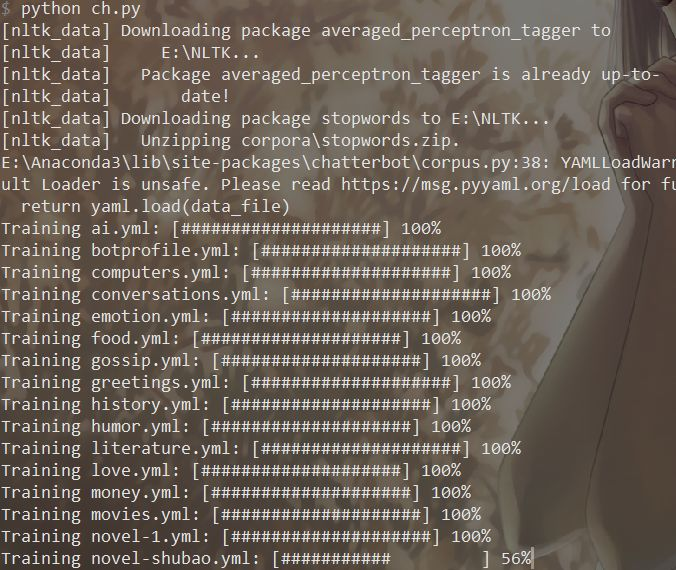

在我的一个[回答](https://www.zhihu.com/question/34098079/answer/758760859)里，我提到了用 Python 搭建聊天机器人。从今天开始，我就带着大家从0开始搭建一个聊天机器人。

（顺便说一句，我喜欢把链接像上面这样加在文字里，如果找不到文中所说的资源，可以看看周围有没有链接。）

---
## 准备工作
首先，**你要有一台安装了 Python 的电脑，推荐 Python3.6+**。另外，**系统最好使用 Windows 系统**，因为把机器人和 QQ 对接的软件 CoolQ 只有 Windows 版，虽然使用 Docker 和 wine 可以在其它系统上运行，但不能保证稳定性。

然后，你需要**在系统中安装并运行 MongoDB 数据库服务**。安装方法可以看这里。记得安装完成之后**运行 MongoDB 服务**，也就是把 MongoDB 作为服务安装到系统中，以保持后台运行。

其次，你可能会需要一个好看的控制台，最好像 Conemu 一样既方便又美观的。*毕竟写累了还可以舔舔老婆（划去*

---
## Chatterbot
[Chatterbot](https://chatterbot.readthedocs.io/) 是一个 Python 库，我们的聊天机器人就是主要基于这一个库。

安装和其他的 Python 库一样简单：

```bash
pip3 install chatterbot chatterbot_corpus
```

其中 chatterbot_corpus 是 Chatterbot 自带的语料库。

现在简单说一下 Chatterbot 的原理。Chatterbot 是比较简单的聊天机器人，它需要大量对话语料来支撑它的运行。当用户给它一个输入时，它会在所有的语料库中寻找和这句话最相似的一句话，然后返回语料库中的下一句。

所以，在使用 Chatterbot 前，我们需要先进行训练。

```python
from chatterbot import ChatBot
from chatterbot.trainers import ChatterBotCorpusTrainer

bot = ChatBot(
    'Sakura',
    storage_adapter='chatterbot.storage.MongoDatabaseAdapter'
)
trainer = ChatterBotCorpusTrainer(bot)
trainer.train("chatterbot.corpus.chinese")
trainer.train("chatterbot.corpus.english")
```

我们分析一下这几行代码。

```python
bot = ChatBot(
    'Sakura',
    storage_adapter='chatterbot.storage.MongoDatabaseAdapter'
)
```

这是创建一个聊天机器人，名字叫 Sakura（你也可以改成自己起的名字），使用 MongoDB 中的数据。*（其实 Chatterbot 还支持 SQL，但是速度太慢了。）*

这句代码里面有一个单词 adapter，官方翻译为“适配器”。其实它更准确的含义是“组件”。创建 Chatbot 时还有很多 xxx_adapter 这样的参数，可以为机器人开启各种各样的功能。不过有一点要注意，有些功能可能只对于英语进行了适配，对其他语言支持并不好。

```python
trainer = ChatterBotCorpusTrainer(bot)
trainer.train("chatterbot.corpus.chinese")
trainer.train("chatterbot.corpus.english")
```

这几行就是具体的训练代码了。注意，这是最新版（2019/8/18）的写法，之前版本有所不同，使用的是`bot.set_trainer(ChatterBotCorpusTrainer)`和`bot.train`，具体写法可以参看网上其他文章。

`chatterbot.corpus.chinese`是 Chatterbot 自带的语料库之一。 Chatterbot 的英文语料库是非常不错的，只是数据量有点少。但是 Chatterbot 的中文语料库是由英文语料库完全机器翻译来的，而且不太符合中文语境。我自己爬取网络言情小说，提取其中的对话，整理了一个[语料库](https://github.com/Wybxc/chinese-corpus)，可以替换 chatterbot 自带的语料库。

上面所说的训练代码单独保存再一个文件里，因为在每次改动语料库之前它只需要运行一次。

现在，把训练的代码运行一下，不出意外的话，你会看到一系列进度条，大概这样：


*Conemu 支持控制台背景图片，欸嘿嘿~（可以猜一下背景是谁，虽然猜对了也没有奖）*

如果你在上面的`[nltk_data]`那里卡住了，属于网络环境的问题，我也没有办法，只能放弃 Chatterbot 框架了（之后的系列文章中会有涉及）。

（2020/2/14补充）**注意！如果在 Chatterbot 启动的时候，出现以`[nltk_data]`开头的网络错误，请看下面的补充内容！ 即使前几次启动成功，在之后的某一次启动失败，也是管用的！**

> （2020/2/3补充）破案了！出现这个问题的原因是 chatterbot 把判断 nltk 数据是否存在的代码写错了，导致每次启动都需要下载数据，再加上特殊的网络环境，就会出现这个问题。
>
> 解决方法如下：首先手动下载 nltk 数据（方法自行百度），然后找到 chatterbot 目录（一般在`python目录/Lib/site-packages/chatterbot`）中的`utils.py`，将最后面几个函数中的`nltk_download_corpus('stopwords')`，`nltk_download_corpus('averaged_perceptron_tagger')`，`nltk_download_corpus('vader_lexicon')`分别改为`nltk_download_corpus('corpora/stopwords')`，`nltk_download_corpus('taggers/averaged_perceptron_tagger')`，`nltk_download_corpus('sentiment/vader_lexicon')`。
>
> 训练完成之后，机器人就能支持基本的对话了。

那么，怎么在自己的代码里插入这个机器人呢？

首先，要创建机器人实例，代码和上面训练时一样：

```python
from chatterbot import ChatBot

bot = ChatBot(
    'Sakura',
    storage_adapter='chatterbot.storage.MongoDatabaseAdapter'
)
```

bot 对象有一个`get_response`方法，顾名思义，就是获取一句回答。

现在可以试一下：

```python
print(bot.get_response('你好吗？'))
```

在经过短暂的等待之后，就能看到机器人的回答啦~

```python
print(bot.get_response('你好吗？'))
# 输出：你好！
```

`get_response`返回的是一个`Statement`对象，它有两个常用的属性`text`和`confindence`，分别代表返回的语句的内容和可信度（0到1）。

```python
r = bot.get_response('你好吗？')
print('{} ,confidence={}'.format(r.text, r.confidence))
# 输出：你好！ ,confidence=1.0
```

这就是基本操作了。*虽然也没有进阶操作就对了（划去*

然后是一只无限对话的小程序：

```python
from chatterbot import ChatBot
bot = ChatBot(
    'Sakura',
    storage_adapter='chatterbot.storage.MongoDatabaseAdapter'
)
def r(s):return bot.get_response(s).text

while True:
    i = input('>>> ').strip()
    if i != 'exit':
        print(r(i))
    else:
        break
```

享受和机器人沙雕对话的乐趣吧！

---
## CoolQ
现在我们已经有了能用的机器人了，但是只有我们一个人和机器人对话没有意思，接下来我们要把它部署到QQ上。

首先你要有一个**QQ小号**，当然不怕吓到朋友的同学也可以用自己的大号当机器人。

**我们使用的软件是酷Q，一个专门用于架设QQ机器人的软件**。酷Q Air 版可以免费使用，支持基本的接收发送文字消息等功能。

运行酷Q并登录之后，我们会在屏幕上看到一个悬浮窗：


*当然头像是你的账号的头像咯*

右键悬浮窗，选择「应用-应用管理」菜单，可以看到一个这样的界面：


这里需要解释一下酷Q运行的原理了。酷Q是依赖于安装的各种「应用」运行的，每个应用其实是一个动态链接库，酷Q通过调用动态链接库的对应接口，执行应用的功能。但是问题来了，Python 并不能编译成动态链接库，该怎么办呢？

大家注意到我的应用列表中最后一个「HTTP API」了吗？这就是解决方法。**[CoolQ HTTP API](https://github.com/richardchien/coolq-http-api)是一个将酷Q的接口封装为HTTP接口或Socket接口的应用**，理论上，它可以解决一切编程语言连接酷Q的问题。

在 CoolQ HTTP API 的 gtihub 仓库的 release 页面可以找到最新版本的下载链接，下载完成之后，将 cpk 文件放入酷Q 目录下的 app 文件夹中。

然后我们需要 Python 端的对应接口。**[Aiocqhttp](https://github.com/richardchien/python-aiocqhttp) 就是 Python 上的 CoolQ HTTP API 接口**。同样，它可以用 pip 安装：

```bash
pip3 install aiocqhttp
```

在连接 CoolQ HTTP API 时，我推荐使用反向 WebSocket 方式，虽然配置起来有点麻烦，但是能保证稳定运行。

**首先配置 CoolQ HTTP API**。在`酷Q目录\app\io.github.richardchien.coolqhttpapi\config`下，找到一个文件名为QQ号的 json 文件，按照如下步骤进行：

- 增加如下两行

```json
"ws_reverse_url": "ws://127.0.0.1:7700/ws/",
"use_ws_reverse": true,
```

*（如果端口号冲突，可以把这里的7700改为其他端口。）*

- 找到access_token行，设置为当前账号的QQ号，或者其他能唯一标识这个账号的信息。（如果不需要同时运行多个机器人， 也可以随便写。）
- 看看这个 json 里有没有use_http 和use_ws这两项，如果没有，添加这两项，并且把值改为false。这是为了on为了禁用用不到的功能。
- 如果有ws_reverse_event_url和`ws_reverse_api_url 这两项，把他们删除。这两项分别表示 WebSocket 的事件接口和方法接口，其值可以由ws_reverse_url自动配置，所以不需要填写。
- 新版 CoolQ HTTP API 会在启动时弹出它自己的控制台，如果嫌它太难看，方法是将show_log_console一项改为false。
- 如果在 Python 端需要执行初始化代码，请将 CoolQ HTTP API 升级到最新版本（v4.14及以上），然后在配置文件中加入这样一行：`"ws_reverse_use_universal_client": true`。

每次修改配置文件之后，都需要重启酷Q。

接下来就可以撸 Python 端的代码了。

先上一个模板代码：

```python
from aiocqhttp import CQHttp

bot = CQHttp(access_token='你刚才设置的 access_token', enable_http_post=False)

@bot.on_message('private')
async def handle_msg(context):
    await bot.send(context, '现在为您复读：')
    return {'reply': context['message']}

if __name__ == '__main__':
    bot.run(host = '127.0.0.1', port = 7700)
```

不要忘了把`access_token`改成刚才设置的内容。

现在我们分析一下这段代码：

```python
bot = CQHttp(access_token='你刚才设置的 access_token', enable_http_post=False)
```

创建一个机器人实例，因为设置了`enable_http_post=False`，所以启用的是反向 WebSocket 模式，这个模式下，只需要传入 access_token 即可。

```python
if __name__ == '__main__':
    bot.run(host = '127.0.0.1', port = 7700)
```

在本地的 7700 端口开启反向 WebSocket 服务。如果机器人的主程序有公网IP，那么还可以实现把任意一个酷Q连接到机器人（虽然我买不起公网IP，也没试过）。

```python
@bot.on_message('private')
async def handle_msg(context):
    await bot.send(context, '现在为您复读：')
    return {'reply': context['message']}
```

这就是机器人的逻辑代码了。Aiocqhttp 把酷Q的各种事件封装为装饰器，最常用的就是`@bot.on_message()`，这个装饰器可以带一个字符串参数， `private`、`group`和`discuss`分别代表私聊消息、群消息、讨论组消息；也可以不带参数 ，表示处理全部消息。除此之外，还有`on_notice`、`on_request`、`on_meta_event`装饰器分别对应其他三种事件。这三种装饰器也可以带参数，参数内容为要处理的事件类型（`notice_type`、`request_type`或`meta_event_type`，具体取值见事件列表）。

处理消息的内容写在函数里。**由于消息的收发是异步的，所以要使用`async def xxx(context):`的语法**。函数名可以任意取，也可以创建多个不同函数名的函数来处理同一个消息（但是我并不确定按什么顺序执行）。

函数参数只有一个：`context`，类型为字典，代表 CoolQ HTTP API 传来的事件参数。具体内容的格式参看这里，比如对于接收消息的事件，`context['message']`就代表了消息内容。

在函数里，**可以通过`await bot.xxx(...)`的语法来调用 CoolQ HTTP API 提供的 API**，在API列表中的API全部可以直接通过bot.API名字()调用，API参数通过命名参数提供，也就是类似于`bot.send_private_msg(user_id=123456, message='hello')`的形式。另外，Aiocqhttp 提供了一个发送消息的简单操作，调用形式为`await bot.send(context, '消息内容')`。

处理事件的函数可以有一个返回值，也是一个字典，代表事件的响应数据，就是事件列表中每 个事件下面的响应数据列表，用于快速处理事件。最简单地，`return {'reply':'消息内容'}`就会回复发来消息的人。在群聊中，如果不指定`'at_sender':false`，还会自动@发消息的人。当然，也可以没有返回值。

上面的这一段代码，就是一个复读机机器人，会自动复读所有的私聊消息。

所以，人类的本质是——


*人类的本质是——*

---
## CoolQ x Chatterbot
现在，终于可以为我们的机器人注入灵魂了。把 Chatterbot 嵌入 CoolQ 机器人实际上并不是一件难事。

废话不多说，直接上代码：

```python
from aiocqhttp import CQHttp
from chatterbot import ChatBot

bot = CQHttp(access_token='你刚才设置的 access_token', enable_http_post=False)
chatterbot = ChatBot(
    'Sakura',
    storage_adapter='chatterbot.storage.MongoDatabaseAdapter'
)
def r(s):
    return chatterbot.get_response(s)

@bot.on_message('private')
async def handle_msg(context):
    rep = r(context['message'].strip())
    if rep.confidence > 0.65:
        return {'reply':rep.text}

if __name__ == '__main__':
    bot.run(host = '127.0.0.1', port = 7700)
```

逻辑很简单，判断回答的可信度是否大于0.65，如果是，作出回答。

当然，可以在这段代码的基础上，进一步拓展，实现更加复杂的处理逻辑。

---

在下一篇文章里，我会介绍我在编写自己的机器人时用到的一些处理逻辑和小技巧。*（虽然也不知道下一篇文章会鸽几个月）*

下一篇文章：[[用 Python 来做一个聊天机器人吧！（二）]]
​
<hr/>

现已加入知乎专栏：[用 Python 来做一个聊天机器人吧！](https://zhuanlan.zhihu.com/c_1209057994874728448)

