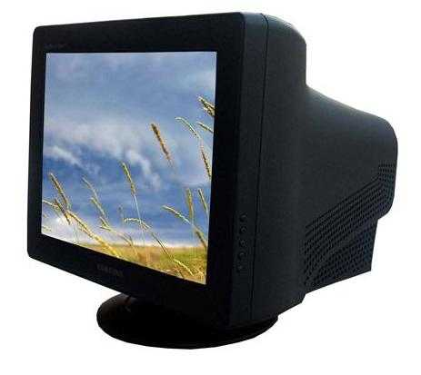

B站有一个传统：空降报颜色（大家应该都懂）。但是有时候，直接点击进度条，会发现进度向前跳了一点，不在点击的位置。了解视频编码的有关知识，就能明白其中的道理。

---
## 最简单的视频格式

众所周知，视频是由很多幅画面组成。这些画面连续播放，利用视觉暂留现象，就能形成动态的图像。**视频中每一幅画面称为“帧”。**

现在你就可以得到最简单的视频格式：把每一帧画面依次储存。

但是问题又来了：每一帧怎么储存？

比较简单的方法是储存位图，就是把每一个像素的颜色值排列起来；复杂一点，可以对图像进行压缩，然后再合成一个视频。

恭喜你，你发明了GIF的简化版。**GIF就是将压缩后的图像排列在一起构成的。**

---
## 帧速率与音频

现在，你有了GIF的简化版，让我来做一个播放器。我写完了解压缩部分，获得了图像的每一帧。

所以问题来了：每一帧图像应该多长时间切换一次？

> 你：电影是每秒24帧，就按这个来吧。
>
> 我：如果要播放的视频比较特殊呢？比如每秒要60帧的。
>
> 你：。。。
>
> 我：不如把每秒播放的帧数储存在文件里，这样就能根据不同的视频以不同的速度播放了。

**每秒播放的帧数称为“帧速率”，用FPS表示。帧速率影响视频播放的快慢，如果帧速率过低，也会出现卡顿现象。**

于是，我做出了第一代播放器，可以播放包含帧速率信息的简单视频。不过这种视频和GIF一样，没有声音。

> 你：能不能做一个带声音的版本？
>
> 我：把声音信息接在视频信息后面就行了。
>
> 你：听起来很Low的样子。
>
> 我：。。。

**现在通行的视频格式，都是视频、音频分别储存的。**

当然，音频也有很多储存格式，比如不压缩的PCM编码（一般用WAV格式储存）、有损压缩的MP3（专利权刚刚过期，大家放心用吧），以及MP3的下一代AAC（MP4视频常用的格式）。

---
## 高清时代

你用带声音的视频格式，做了一段小视频。很快，你就发现了问题。

> 你：这个视频画质怎么这么渣。
>
> 我：你录的时候就没弄高清的，怪我咯~
>
> 你：我这个视频可是用好几百万像素的手机录的呢。
>
> 我：你是不是有什么地方设置错了？分辨率只有640×480，当然画质差了。
>
> 你：分辨率是啥？

**在视频领域，分辨率一般指每帧画面大小，用A×B表示，其中A是一行的像素数量，B是一列的像素数量。**有些常用的分辨率，比如640×480、1280×720、1920×1080，可以用640p、720p、1080p代替。（还有类似的640i、720i、1080i，区别会在以后讲到。）其中，720p又称高清，1080p又称超清。

*（来源：由Original uploader was XXV at en.wikipedia Later version(s) were uploaded by Jjalocha, Aihtdikh at en.wikipedia. - Transferred from en.wikipedia，CC BY-SA 3.0，File:https://commons.wikimedia.org/w/index.php?curid=4022444）*

你现在修好了手机，成功拍摄了1080p超清的视频。拿来播放时，发现事情并不简单。

2分钟的视频，居然占用了1.84G的空间！

> 你：这个视频为什么这么大？
>
> 我（拿出计算器）：分辨率是1920×1080，每个像素是24位，压缩后一帧是607.5KB；每秒24帧，一秒大约是142.4MB，两分钟就是大约1.842GB，没问题啊。
>
> 你：有什么办法能让它小一点吗？
>
> 我：当然有。

---
## 帧间压缩

刚才的视频格式只是把每一帧图像进行压缩，这种方法称为帧内压缩。但帧内压缩的压缩率仍旧不高。按照数学史和修仙的发展规律，是时候来一次返璞归真了。

> 视频，是为了表现什么？
>
> 一幅一幅的画面吗？
>
>  
> 不是。
>
> 视频的本质在于运动。
>  
>
> 为了达到运动的效果，人们才发明了视频。但是，运动是连续的，视频只是用一帧帧离散的画面去模仿运动。既然是离散的……
>
> 那就离散得再彻底一点！

MPEG横空出世。

**MPEG-1的第二部分规定了GOP（Group of Pictures，图像群组）的概念。**一个视频包含若干个GOP，一个GOP包含若干帧。

*（来源：由GOP_2.png: Benutzer:MuldeRderivative work: Dvaer (talk) - GOP_2.png，公有领域，File:https://commons.wikimedia.org/wiki/File:GOP_2.svg）*

**GOP内的帧分为三种：I帧、B帧和P帧**，就是图中的I、B、P。**其中I帧包含完整的图像信息并进行帧内压缩，而B、P帧只包含图像的一部分，图像的其他部分通过和其他图像运算得出。**（P帧参考I帧和之前的P帧，B帧参考之前和之后的I、P帧。）

这是什么意思呢？

举个栗子：要做一段小球滚动的视频，开头和结尾分别是：

*（用画图做的，比较简陋）*

在编码时，因为背景都是不变的，所以只需要比较两幅图中不同的部分，也就是小球的画面和小球运动轨迹的背景（因为需要擦除小球在上一帧的图像）。这样，把第一帧作为I帧，后面的作为B、P帧，就可以自动运算生成小球运动的画面。

这种压缩方法不是顺序解码的，而是先解码I帧，再根据I帧解码第一个P帧，然后解码I、P帧之间的B帧并播放，之后根据P帧解码下一个P帧，再解码B帧，最后按照这个方法继续解码后面的内容。Wiki上可能说的清楚一点：

> 显示的顺序是：I0、B1、B2、B3、P4、B5、B6、B7、P8、B9、B10、B11、I12；则编解码顺序为：I0、P4、B1、B2、B3、P8、B5、B6、B7、I12、B9、B10、B11。

**I帧还有一个响亮的名字，叫做关键帧**，但是这个关键帧要和视频编辑软件中的关键帧区分开，前者只在编码、解码时使用，后者只在设计时使用。

> 你：既然关键帧这么好，那怎么安排呢？
>
> 我：比较常用的格式中，一个视频文件中GOP的长度都是相同的。**GOP的长度又叫做关键帧间隔。**比如设置关键帧间隔为33，那么每隔33帧就会有一个关键帧。
>
> 你：那关键帧间隔越短，视频是不是越清晰？
>
> 我：对，但是视频也会越来越大。
>

现在可以回答标题提出的问题了：为什么不能完全精准空降？

答案只有一句话：**普通的视频播放软件只能把进度调到关键帧的位置。**

好了，大家可以散了。

---
## 场

> 你：你怎么还没走？
>
> 我：坑还没填完，我怎么可以走呢？

大家还记得我提过的720p和720i吗？两者的区别就在于场序。

> 你：场是啥？场序又是啥？

其实场和场序是一个历史遗留问题。

还记得以前的显示器是什么样的吗？

就是这种带着大头的，叫做CRT显示器。它使用阴极射线管成像，可以使用三色光混合，产生丰富的色彩。但是CRT有一个缺点，就是不能持久显示。因此，随着视频分辨率不断升高，人们发现了问题：

如果一行一行的显示，显示下面的图像时，上面的就消散了。这样图像一会儿有一会儿没有，就产生了严重的闪烁。

人们当然是有解决办法的：

既然显示不了这么多，就少显示一点吧。

**在传统的CRT显示器上，视频要分为两部分：一部分是奇数行，称为“上场”或“高场”；另一部分是偶数行，称为“下场”或“低场”。CRT在显示视频时，先显示高场，再显示低场，就能解决闪烁的问题。**

> 你：为什么先显示高场，再显示低场？倒过来不行吗？
>
> 我：**先显示高场的叫做高场优先或上场优先，先显示低场的叫做低场优先或下场优先。电视台的视频一般都是高场优先的。这就是两种场序。**
>
> 你：那么720p和720i就是高场优先和低场优先之分了！
>
> 我：错。场序可不止有这两种。
>
> 你：。。。

在液晶显示器已经普及的今天，已经不用再分高场低场了，直接一行一行的显示，反而能减少视频对眼的伤害。**这种逐行扫描的方式又叫做无场，是第三种场序。**

与逐行扫描相对，高场优先和低场优先统称为隔行扫描。720i的i就是指隔行扫描，而p指逐行扫描。

由于现在隔行扫描的视频少了，所以720i、1080i就逐渐被埋没，720p、1080p则成为高清（HD）、超清（Full HD）的代名词。

> 你：那么，录视频的时候，录哪一种场序的视频好呢？
>
> 我：这要看视频播放的领域了。如果要在电视台播放，看电视台的规定（一般为高场优先）；如果要在网络传输播放，最好是无场视频。

---
## 比特率

> 你：坑都填完了，为什么还不走？
>
> 我：你咬我呀~

**比特率又叫码率，是视频三个重要参数之一（帧率、码率、分辨率），单位是bps（bit per second，每秒二进制位数）。**比特率直接决定视频的大小，用平均码率（bps）乘时长（s）就能得到视频的大小（bit）。*（单位换算：1GB=1024MB，1MB=1024KB，1KB=1024B，1B=8bit，1Kbps=1000bps，1Mbps=1000Kbps）*

注意到，我刚才说的是“平均码率”，而不是“码率”。这是因为一个视频在不同部分的码率可能是不同的，这取决于视频在压制时的设置。

在用软件压制视频时，可以看到有 CBR 、 VBR（一次）和 VBR（两次）三种码率格式。

CBR 是固定码率，整个视频在任何一处的码率都是相同的。

VBR 是可变码率，软件根据画面的复杂程度，对复杂的画面采用更少的压缩，对简单的画面采用更多的压缩，能够保证在整个视频的大小不变的情况下有更好的效果。VBR 还有一次和两次之分。一次就是指整个视频只渲染一遍，每个地方的码率靠预测算出，压缩效果比两次略差，但是耗时短；两次就是整个视频先预览一遍，确定每一处的码率，再重新渲染压制，压缩效果理论上比一次要好，但实际上两者相差无几，而且两次的速度非常慢，**所以我推荐用 VBR（一次）。**

引入码率的概念之后，视频的清晰度将不只取决于分辨率。码率代表着视频的信息量，如果用相同的信息量去描述更大的画面，必然要丢失细节。**所以在同样的码率下，1080p 甚至不如 720p 清晰。**

> 你：WTF？
>
> 我：
>
> 你：那么，把码率设置为多少合适呢？

**最大码率一般设置为平均码率（目标码率）的2~3倍。**

- 如果要用高品质的视频，平均码率可以设置为 20Mbps（20000Kbps）。
- 如果要在视频网站投稿，取决于视频网站的规定。以B站为例：码率不超过 1800Kbps 的，会直接上传；超过 1800Kbps 的，会被网站二次压制。我推荐大家尽把码率设置高一点（2~3Mbps），因为现在的二次压制技术已经不是从前的“精美视频压成翔”的技术了，现在二次压制有了很大进步，有时候效果甚至要比你自己压缩比特率的效果要好很多。
- 如果是你自己作死玩，可以试试 1080p + 200Kbps 的配置，你会真正体会到“高清也拯救不了的画质”。

---
## 结语

这篇文章写作历时三个月。不是因为内容多，而是因为在这三个月里我只写了三天。（逃）

这些是我在刚接触 Pr、Ae 这些视频剪辑软件时的学习的心得，希望能对大家有所帮助。